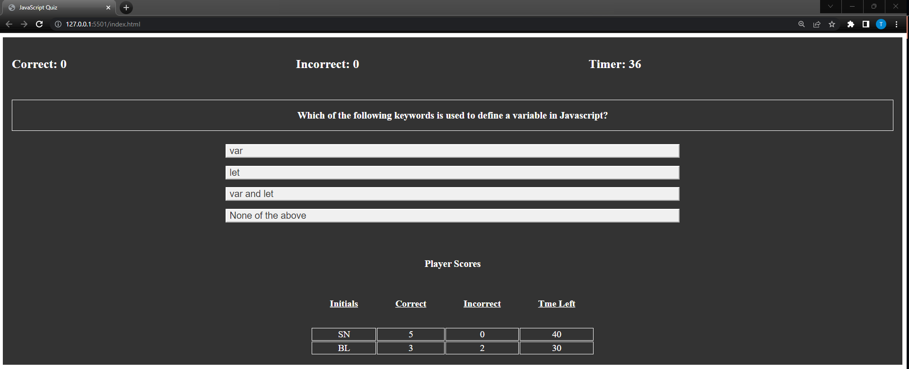

# Rutgers-Module4 (JavaScript Quiz)

# Task

For this assignment, we were tasked with building a JavaScript Quiz.

This application should have the following functionality:

*  When the user clicks the start button, the first question should be displayed, and a timer should start a countdown. 
 
*  If the user selects an answer, we should display whether the answer is correct or incorrect.
  
*  If the answer is incorrect, the user loses 10 seconds from the countdown
 
*  The quiz ends when the user answers the last question or runs out of time.
 
*  After each quiz, the user should be able to enter their initials, and we should save it to Local storage.

*  The scores should then be retrieved from local storage and displayed to the user.

## Additionally:

Host this on GitHub Pages and include a screenshot in this README file as well.

Here is a link to this page: [GitHub Pages Project Link](https://tneiman19.github.io/Rutgers-Module4/)

Credit to [InterviewBit](https://www.interviewbit.com/javascript-mcq/) for the Javascript questions and answers used in this project.
